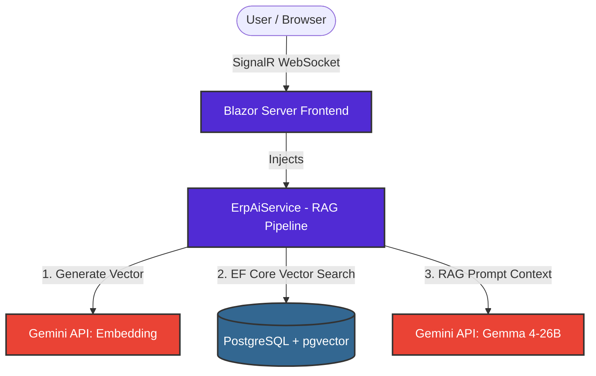

# 🏗️ YnYMono – AI-Powered Industrial ERP (Blazor Monolith)

An industrial-grade, monolithic SaaS that combines live ERP inventory management with a state-of-the-art AI Domain-Expert Agent capable of diagnosing machinery issues in real-time. 

While microservices offer isolated scaling, **YnYMono showcases the incredible speed, simplicity, and power of a Unified Monolith Architecture**. By combining the Frontend, ERP business logic, and complex AI workflows (Retrieval-Augmented Generation) into a single **.NET 8 Blazor** application, we drastically reduce deployment complexity and network latency.

## ✨ The Elevator Pitch

Don't just track your equipment—troubleshoot it. YnYMono uses a built-in Retrieval-Augmented Generation (RAG) pipeline powered by Google's Gemini APIs and PostgreSQL `pgvector`. When a user reports a strange noise from a pump, the AI performs a vector similarity search via **Entity Framework Core** to retrieve the exact manufacturer maintenance manual and synthesizes a safe, factual resolution—all executed within a single C# environment.

## 🚀 Key Features

* **Monolithic Simplicity:** Frontend UI, ERP database logic, and RAG AI logic all live harmoniously inside a single .NET 8 Blazor Server application. No CORS issues, no separate API deployments.
* **Real-time UI via Blazor:** Uses `@rendermode InteractiveServer` via SignalR to provide immediate feedback, dynamic loading states, and a SPA-like feel without writing JavaScript.
* **Native C# AI Providers:** Implements custom `IAiProvider` interfaces to seamlessly handle Google's Gemini API (`gemini-embedding-001` and `gemma-4-26b-a4b-it` MoE models), including intelligent vector dimension truncation (3072 → 768).
* **Unified Vector Database:** PostgreSQL handles standard relational tables (`Products`) and 768-dimensional mathematical vector embeddings (`manual_knowledge`) natively via the `pgvector` extension.
* **EF Core Snake_Case Mapping:** Uses `EFCore.NamingConventions` to perfectly map C# PascalCase models to PostgreSQL snake_case tables.

## 🏗️ Architecture & Data Flow



## 🛠️ Tech Stack

| Tier               | Technology              | Why we chose it                                              |
| :----------------- | :---------------------- | :----------------------------------------------------------- |
| **Frontend & API** | .NET 8 Blazor           | Extreme development speed. Sharing C# models natively between UI and Server completely eliminates data mapping errors. |
| **Database**       | PostgreSQL + `pgvector` | Eliminates the need for a separate Vector DB by handling both standard SQL and Cosine Distance (`<=>`) vector math. |
| **ORM**            | Entity Framework Core 8 | Seamlessly translates C# LINQ queries into raw SQL and vector search operations. |
| **LLMs (Cloud)**   | Google Gemini API       | Utilizing `gemma-4-26b-a4b-it` for real-time generative troubleshooting and `gemini-embedding-001` for vectorization. |

## 💻 Local Development Setup

Want to run this Monolith locally? Follow these steps:

### 1. Database Configuration

Ensure you have a PostgreSQL instance running (Google Cloud SQL or local Docker) with the `pgvector` extension enabled. Connect to your database and run:

```sql
CREATE EXTENSION IF NOT EXISTS vector;
```

### 2. Configure App Settings

Update your `appsettings.Development.json` (or `appsettings.json`) file with your database string and API Key:

```json
{
  "ConnectionStrings": {
    "DefaultConnection": "Host=localhost;Database=postgres;Username=postgres;Password=YOUR_PASSWORD"
  },
  "AiSettings": {
    "GeminiApiKey": "YOUR_GOOGLE_GEMINI_API_KEY",
    "UseLocalModel": false
  }
}
```

### 3. Run EF Core Migrations

Because we are using Entity Framework Core, you need to apply the database migrations to generate the `Products` and `manual_knowledge` tables with the exact vector dimensions.

```bash
dotnet tool install --global dotnet-ef
dotnet ef database update
```

### 4. Run the Application

Start the Blazor app!

```bash
dotnet restore
dotnet run
```

The app will be live at `http://localhost:5206`.

## 🧠 Handling Vector Dimensionality

Google's newest embedding models return 3072 dimensions, but our database is optimized for 768. YnYMono handles this directly in the C# `CloudGeminiProvider` by combining an API payload request (`outputDimensionality: 768`) with a safety LINQ slice (`.Take(768).ToArray()`) to guarantee zero database crashes.

## 🤝 Contributing

Contributions, issues, and feature requests are welcome! Feel free to check the issues page.

## 📝 License

This project is MIT licensed.

